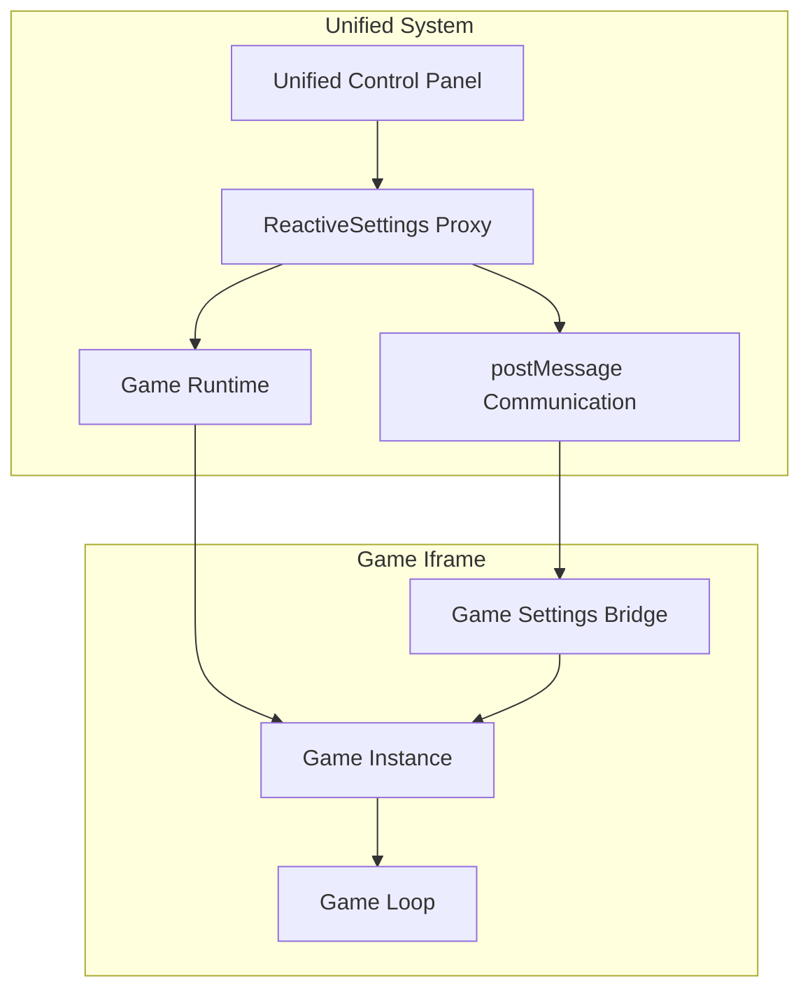

# Design Document

## Overview

This design document outlines the implementation of a Hybrid Reactive + Hooks System for the Unified Brain Training platform. The system will enable real-time, automatic synchronization of game settings between the unified control panel and individual brain training games using a proxy-based reactive settings object with optional onChange hooks for complex reactions.

The design leverages the existing postMessage communication system and dat.GUI infrastructure while introducing minimal changes to existing game code. Games will simply read settings values naturally (e.g., `settings.ballSpeed`) and automatically receive updated values when changes occur in the unified control panel.

## Architecture

### System Components



### Core Architecture Principles

1. **Reactive Settings**: A JavaScript Proxy that intercepts property access and automatically notifies listeners when values change
2. **Minimal Game Changes**: Games continue reading settings using existing syntax (`settings.ballSpeed`)
3. **External Control**: Settings are truly external - games never "own" them, only read current values
4. **Optional Hooks**: Complex reactions can use onChange hooks for expensive operations
5. **Backward Compatibility**: System works with existing games without breaking changes

## Components and Interfaces

### 1. ReactiveSettings Class

The core reactive system that creates a proxy-based settings object:

```javascript
class ReactiveSettings {
  constructor(schema) {
    this.schema = schema;
    this.values = {};
    this.listeners = {};
    
    // Initialize with defaults
    for (const [key, config] of Object.entries(schema)) {
      this.values[key] = config.default;
      this.listeners[key] = [];
    }
    
    // Return proxy that intercepts all access
    return new Proxy(this, {
      get(target, prop) {
        if (prop in target.values) {
          return target.values[prop];
        }
        return target[prop];
      },
      
      set(target, prop, value) {
        if (prop in target.values) {
          const oldValue = target.values[prop];
          target.values[prop] = value;
          
          // Notify listeners
          target.listeners[prop].forEach(fn => fn(value, oldValue));
          
          return true;
        }
        return false;
      }
    });
  }
  
  onChange(key, callback) {
    if (this.listeners[key]) {
      this.listeners[key].push(callback);
    }
  }
}
```

### 2. GameRuntime Class

Manages the lifecycle and settings synchronization for individual games:

```javascript
class GameRuntime {
  constructor(definition) {
    this.definition = definition;
    this.settings = new ReactiveSettings(definition.settings);
    this.instance = null;
  }
  
  async load(container) {
    this.instance = await this.definition.init(container, this.settings);
    return this;
  }
  
  updateSettings(changes) {
    Object.assign(this.settings, changes);
  }
}
```

### 3. Enhanced UnifiedBrainTraining Integration

Extends the existing UnifiedBrainTraining class with reactive settings support:

```javascript
// Extension to existing UnifiedBrainTraining class
class UnifiedBrainTraining {
  // ... existing methods ...
  
  initializeReactiveSettings() {
    // Create reactive settings for current game
    const gameSchema = this.getGameSettingsSchema(this.currentGameId);
    this.reactiveSettings = new ReactiveSettings(gameSchema);
    
    // Sync with existing dat.GUI
    this.syncReactiveSettingsWithGUI();
    
    // Setup communication bridge
    this.setupReactiveSettingsBridge();
  }
  
  syncReactiveSettingsWithGUI() {
    // Sync GUI changes to reactive settings
    this.gui.__controllers.forEach(controller => {
      const originalOnChange = controller.__onChange;
      controller.onChange((value) => {
        if (originalOnChange) originalOnChange(value);
        
        // Update reactive settings
        if (this.reactiveSettings && controller.property in this.reactiveSettings.values) {
          this.reactiveSettings[controller.property] = value;
        }
        
        // Send to game
        this.sendReactiveSettingsToGame();
      });
    });
  }
  
  sendReactiveSettingsToGame() {
    const iframe = document.getElementById(`game-iframe-${this.currentGameId}`);
    if (iframe && iframe.contentWindow) {
      iframe.contentWindow.postMessage({
        type: 'reactiveSettingsUpdate',
        gameId: this.currentGameId,
        settings: this.reactiveSettings.values
      }, '*');
    }
  }
}
```

### 4. Game Settings Bridge

Injected into each game iframe to handle reactive settings communication:

```javascript
// Injected into game iframes
window.reactiveSettingsBridge = {
  settings: null,
  
  initialize(initialSettings) {
    // Create reactive proxy for game-side settings
    this.settings = new Proxy(initialSettings, {
      get(target, prop) {
        return target[prop];
      },
      set(target, prop, value) {
        target[prop] = value;
        return true;
      }
    });
    
    // Replace global settings object
    if (window.settings) {
      Object.setPrototypeOf(window.settings, this.settings);
      Object.assign(window.settings, this.settings);
    }
  },
  
  updateSettings(newSettings) {
    if (this.settings) {
      Object.assign(this.settings, newSettings);
      
      // Trigger any existing update mechanisms
      if (window.updateSettings) {
        window.updateSettings(newSettings);
      }
    }
  }
};

// Listen for settings updates from parent
window.addEventListener('message', (event) => {
  if (event.data.type === 'reactiveSettingsUpdate') {
    window.reactiveSettingsBridge.updateSettings(event.data.settings);
  }
});
```

## Data Models

### Settings Schema Definition

Each game defines its settings schema with type information and defaults:

```javascript
const jiggleFactorialSchema = {
  level: { type: 'range', min: 1, max: 10, default: 2 },
  ballSpeed: { type: 'range', min: 0.1, max: 2.0, default: 0.1, step: 0.1 },
  movementMode: { 
    type: 'select', 
    options: ['Non-Rotating', 'Rotating', 'Combination'], 
    default: 'Combination' 
  },
  numBlueDistractors: { type: 'range', min: 0, max: 20, default: 5 },
  autoProgression: { type: 'boolean', default: true }
};
```

### Communication Message Format

Standardized message format for settings synchronization:

```javascript
{
  type: 'reactiveSettingsUpdate',
  gameId: 'jiggle-factorial',
  timestamp: 1699123456789,
  settings: {
    level: 3,
    ballSpeed: 0.2,
    movementMode: 'Rotating'
  }
}
```

## Error Handling

### Graceful Degradation Strategy

1. **Communication Failure**: If postMessage fails, games continue with last known settings
2. **Invalid Settings**: Reactive system validates against schema and rejects invalid values
3. **Missing Settings**: Games fall back to default values from schema
4. **Proxy Errors**: Fallback to direct object access if Proxy is not supported

### Error Recovery Mechanisms

```javascript
class ReactiveSettings {
  set(target, prop, value) {
    try {
      // Validate against schema
      if (!this.validateSetting(prop, value)) {
        console.warn(`Invalid setting value: ${prop} = ${value}`);
        return false;
      }
      
      const oldValue = target.values[prop];
      target.values[prop] = value;
      
      // Safely notify listeners
      this.safeNotifyListeners(prop, value, oldValue);
      
      return true;
    } catch (error) {
      console.error('ReactiveSettings error:', error);
      return false;
    }
  }
  
  safeNotifyListeners(prop, value, oldValue) {
    if (this.listeners[prop]) {
      this.listeners[prop].forEach(fn => {
        try {
          fn(value, oldValue);
        } catch (error) {
          console.error('Settings listener error:', error);
        }
      });
    }
  }
}
```

## Testing Strategy

### Unit Testing

1. **ReactiveSettings Class**: Test proxy behavior, listener notifications, validation
2. **GameRuntime Class**: Test settings synchronization and lifecycle management
3. **Communication Bridge**: Test message passing and error handling

### Integration Testing

1. **End-to-End Settings Flow**: Test settings changes from GUI to game display
2. **Multi-Game Switching**: Test settings persistence across game switches
3. **Error Scenarios**: Test graceful degradation and recovery

### Performance Testing

1. **Settings Update Latency**: Measure time from GUI change to game update
2. **Memory Usage**: Monitor proxy overhead and listener management
3. **Communication Overhead**: Test postMessage performance with frequent updates

### Manual Testing Scenarios

1. **Real-time Visual Feedback**: Change ball speed and observe immediate effect
2. **Rapid Setting Changes**: Test system stability with quick successive changes
3. **Game Restart with Settings**: Verify settings persist through game restarts
4. **Cross-Game Settings**: Test that game-specific settings don't interfere

## Implementation Phases

### Phase 1: Core Reactive System
- Implement ReactiveSettings class
- Create basic proxy functionality
- Add onChange hook support
- Unit tests for core functionality

### Phase 2: UnifiedBrainTraining Integration
- Extend existing UnifiedBrainTraining class
- Integrate with dat.GUI system
- Implement settings synchronization
- Add communication bridge injection

### Phase 3: Game-Side Integration
- Create settings bridge for game iframes
- Implement message handling
- Add fallback mechanisms
- Test with Jiggle Factorial game

### Phase 4: Testing and Refinement
- Comprehensive testing suite
- Performance optimization
- Error handling improvements
- Documentation and examples

## Design Decisions and Rationales

### Why Proxy-Based Approach?
- **Transparent Integration**: Games read settings naturally without API changes
- **Automatic Reactivity**: No need to manually call update functions
- **Type Safety**: Can validate settings at access time
- **Debugging**: Easy to intercept and log all settings access

### Why Optional Hooks?
- **Performance**: Only expensive operations need hooks
- **Simplicity**: Most games just read values directly
- **Flexibility**: Complex games can react to specific changes
- **Backward Compatibility**: Existing games work without hooks

### Why External Settings?
- **Separation of Concerns**: Games focus on gameplay, not settings management
- **Unified Control**: Single source of truth for all settings
- **Easy Testing**: Settings can be modified externally for testing
- **User Experience**: Consistent settings interface across games

This design provides a robust, performant, and maintainable solution for reactive settings integration while preserving the existing game architecture and ensuring minimal disruption to current functionality.